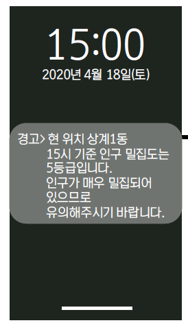
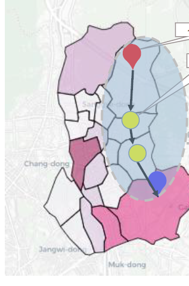
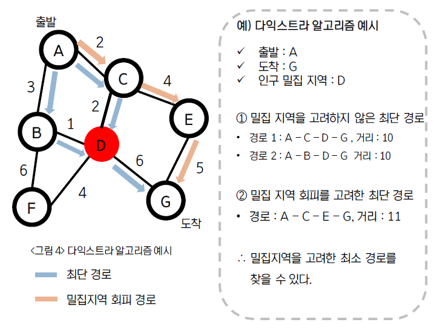
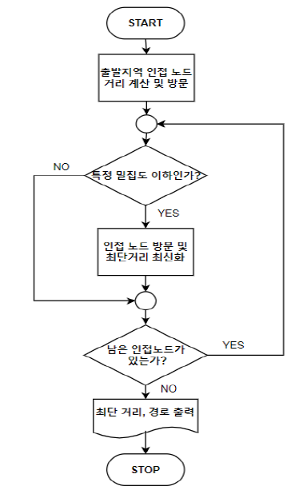
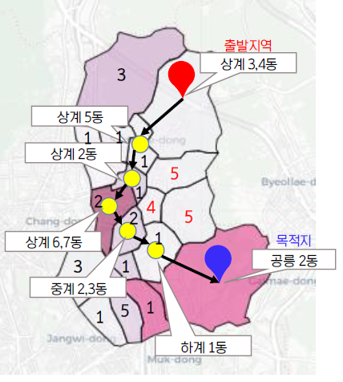
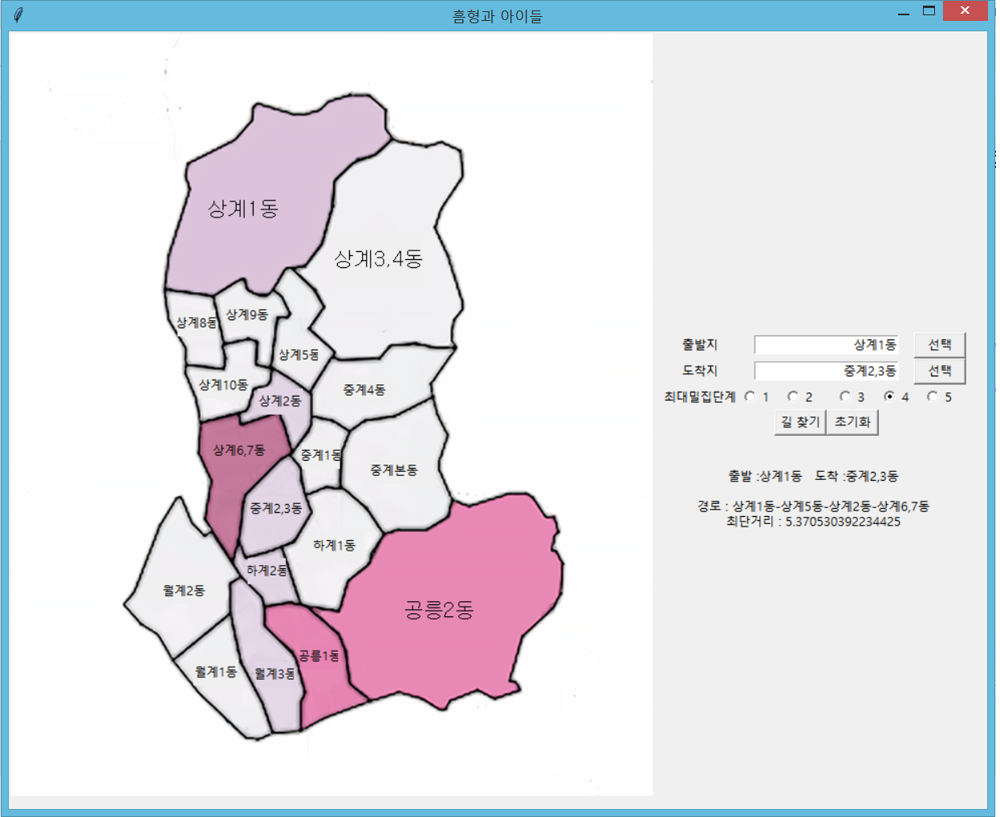

# Densely-Populated-Area-Service

## 프로젝트명_ 인구 밀집 지역 알리미 & 최적 경로 추천 프로젝트

## 프로젝트 목표

> 실시간 현 위치 인구 밀집도(유동인구/면적)를 계산 후, 맞춤형 안내 메시지 제공

> 목적지까지 인구 밀집도가 낮은 최적 경로 제시

## 주제 선정 배경

1. 집단 감염 사건의 발생을 인한  코로나19 확진자의 급격한 증가
2. 늘어난 코로나19에 대한 두려움
3. 코로나19 감염에 대한 두려움으로 인한 유동인구 감소
4. 코로나 블루

## 개발 환경

- python 3.7.7

## 사용 라이브러리

- **Scientific Computation**

  - pandas

  - numpy

  - os

  - re

  - time

  - sys

  - json

  - haversine

  - copy

  - tkinter

- **Visualization/Interactive**

  - seaborn

  - matplotlib

  - plotly

  - folium

  

## 활용 데이터

> 유동인구 데이터(SK텔레콤)

> 카드 매출 데이터(신한카드)

> SNS 데이터(와이즈넛)

> 유통 데이터(GS리테일)

> 물류 데이터(CJ올리브네트웍스)

> 시군구 행정구역 경계도

> 지리 데이터

* 저작권 문제로 인한 비공개

## 서비스 설명

> ### 인구 밀집 지역 알리미

 * 실시간 현 위치 인구 밀집도(유동인구/면적)를 계산 후, 맞춤형 안내 메시지 제공

> ### 최적 경로 서비스

* 다익스트라 알고리즘 이용, 인구 밀집도가 낮은 최적 경로 제시
  

  * 다익스트라 알고리즘
    
  * 순서도
    

## 모델 실행 결과

### 서비스 제시

1. 목적지 설정 후 이동 시작
2. 목적지, 경유지의 밀집도 계산
   * 밀집도 = 해당 지역의 유동인구(명) / 해당 지역의 면적(km^2)
3. 최적 경로 제공
4. 목적지 도착 후 등급에 따른 알림

## 기대 효과

1. 비교적 안전한 신체활동 가능
2. 효과적인 사회적 거리두기
3. 코로나 감염에 대한 불안감 해소
4. n차 감염 예방
